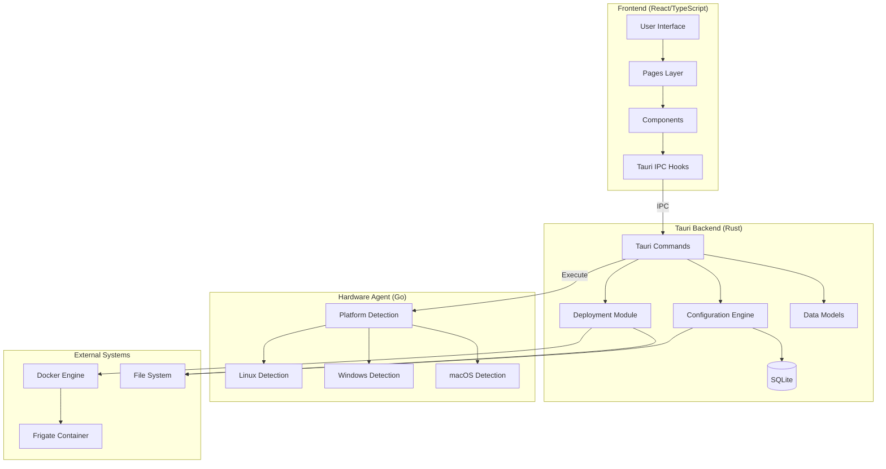
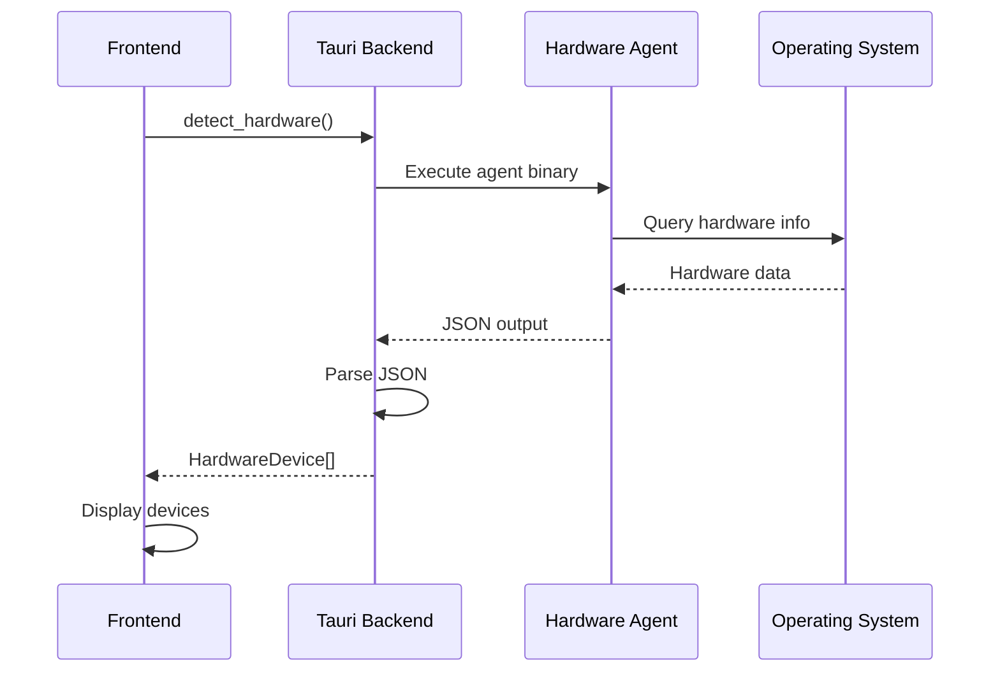
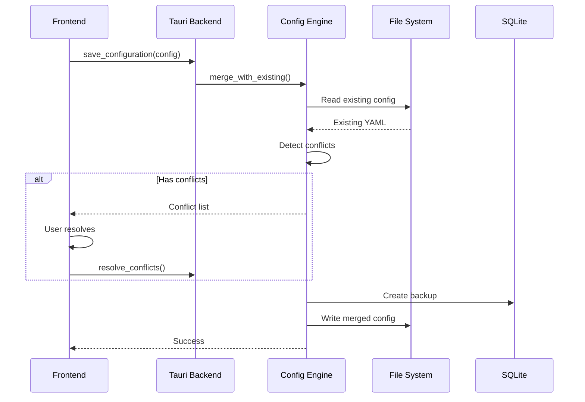
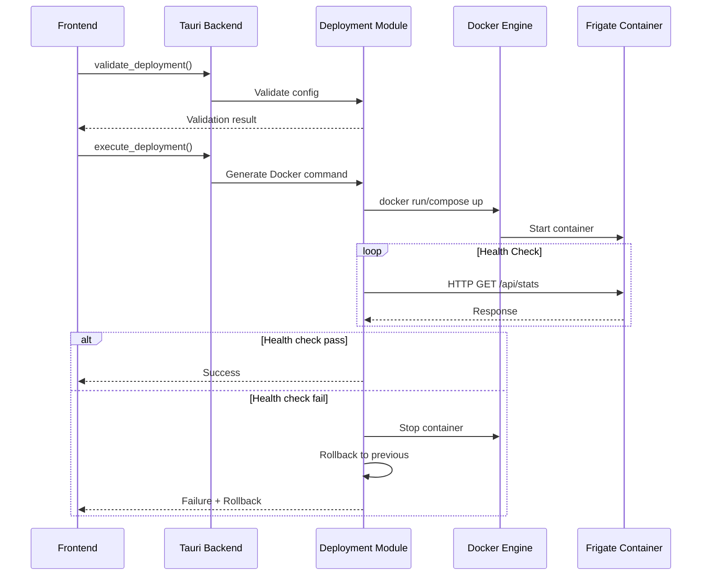

# Frigate Configuration Tool - Architecture

## Overview

The Frigate Configuration Tool is a cross-platform desktop application built with **Tauri**, **Rust**, and **React/TypeScript** to simplify Frigate NVR setup and deployment.

## System Architecture



## Module Details

### 1. Frontend (src-ui/)

**Technology**: React 18 + TypeScript + Vite

**Responsibilities**:
- User interface rendering
- User interaction handling
- State management
- IPC communication with Tauri backend

**Key Pages**:
- `Hardware.tsx` - Hardware detection display
- `Cameras.tsx` - Camera configuration
- `ManualConfig.tsx` - YAML editor
- `Deploy.tsx` - Deployment management
- `DiskMapping.tsx` - Volume configuration
- `Logs.tsx` - Container log viewer

**Key Components**:
- `DeviceCard.tsx` - Hardware device display
- `CameraForm.tsx` - Camera configuration form
- `DiskInfoCard.tsx` - Disk information display
- `VolumeSelector.tsx` - Volume mapping selector
- `DeploymentProgress.tsx` - Deployment status
- `HealthCheckStatus.tsx` - Health check display

### 2. Tauri Backend (src-tauri/src/)

**Technology**: Rust 1.75+ + Tauri 1.5+

**Responsibilities**:
- Business logic execution
- File system operations
- Database management
- External process execution
- Docker interaction

**Modules**:

#### Configuration Engine (`config_engine/`)
- `parser.rs` - YAML parsing with comment preservation
- `merger.rs` - Conflict detection and resolution
- `backup.rs` - Backup creation and rollback
- `validator.rs` - Configuration validation

#### Deployment Module (`deployment/`)
- `docker.rs` - Docker command generation
- `executor.rs` - Command execution
- `validator.rs` - Pre-deployment validation
- `health.rs` - Health check polling
- `rollback.rs` - Deployment rollback
- `disk.rs` - Disk information and volume validation

#### Commands (`commands/`)
- `agent.rs` - Hardware detection commands
- `config.rs` - Configuration management commands
- `deploy.rs` - Deployment commands
- `disk.rs` - Disk and volume commands

#### Models (`models/`)
- `hardware_device.rs` - Hardware device model
- `camera_configuration.rs` - Camera config model
- `deployment_state.rs` - Deployment state model
- `volume_mapping.rs` - Volume mapping model
- `conflict_resolution.rs` - Conflict resolution model

### 3. Hardware Agent (agent/)

**Technology**: Go 1.21+

**Responsibilities**:
- Platform-specific hardware detection
- Device enumeration
- JSON output generation

**Platforms Supported**:
- Linux (x86_64, ARM64)
- Windows (x86_64)
- macOS (x86_64, ARM64)

**Detection Capabilities**:
- Intel QuickSync
- NVIDIA CUDA/NVENC
- AMD VAAPI
- Apple VideoToolbox
- Hailo NPU (Linux ARM)
- Coral TPU

### 4. Database (SQLite)

**Schema**:
- `backups` - Configuration backup metadata
- `deployments` - Deployment history
- `snapshots` - Configuration snapshots

## Data Flow

### 1. Hardware Detection Flow



### 2. Configuration Merge Flow



### 3. Deployment Flow



## Security Model

### Input Validation
- All user inputs validated at frontend
- Backend re-validates all inputs
- Path traversal prevention
- SQL injection prevention (parameterized queries)

### Privilege Management
- No elevated privileges required
- User-level file system access only
- Docker access through user's Docker socket

### Audit Logging
- All configuration changes logged
- Deployment history tracked
- Backup metadata stored

## Cross-Platform Support

### Platform-Specific Code

| Platform | Hardware Detection | File Paths | Package Format |
|----------|-------------------|------------|----------------|
| Linux | lsusb, /dev/dri/* | /etc/frigate | .AppImage |
| Windows | WMIC, nvidia-smi | C:\ProgramData\Frigate | .msi |
| macOS | system_profiler | ~/Library/Frigate | .dmg |

### Architecture Support
- x86_64 (Intel/AMD)
- ARM64 (Apple Silicon, Raspberry Pi, etc.)

## Performance Considerations

### Optimizations
- Async file I/O (Tokio)
- Lazy loading in UI
- Debounced user inputs
- Efficient YAML parsing
- Connection pooling for Docker API

### Resource Usage
- Memory: ~50MB base + ~10MB per camera
- CPU: Minimal (mostly I/O bound)
- Disk: Configuration + backups (~1MB per backup)

## Testing Strategy

### Test Coverage
- Unit tests: 101 tests (core logic)
- Integration tests: 24 test files
- E2E tests: Playwright (user flows)
- Coverage target: >80% for core modules

### Test Types
1. **Unit Tests** - Individual functions/methods
2. **Integration Tests** - Module interactions
3. **Contract Tests** - Agent JSON schema
4. **E2E Tests** - Full user workflows

## Build and Deployment

### Development
```bash
npm run dev          # Start dev server
cargo test           # Run Rust tests
cd agent && go test  # Run Go tests
npm run test:e2e     # Run E2E tests
```

### Production Build
```bash
npm run build        # Build Tauri app
```

### Artifacts
- Linux: `.AppImage`
- Windows: `.msi` installer
- macOS: `.dmg` disk image

## Future Enhancements

1. **Cloud Sync** - Configuration backup to cloud
2. **Multi-Instance** - Manage multiple Frigate instances
3. **Template Library** - Pre-configured camera templates
4. **Plugin System** - Extensible detection logic
5. **WebUI Mode** - Optional web-based interface

## References

- [Tauri Documentation](https://tauri.app)
- [Frigate NVR](https://frigate.video)
- [Project Constitution](../.specify/memory/constitution.md)
