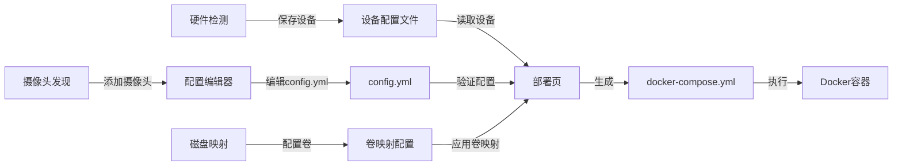

# Change Proposal: 修复关键 Bug 并优化系统工作流程

**ID**: fix-critical-bugs-and-workflow
**Status**: 🟡 待审核
**Priority**: P0 - Critical Bug
**Created**: 2025-10-16
**Depends On**: fix-hardware-device-insertion-complete (已完成)

## Why (为什么)

系统存在多个关键功能缺陷，严重影响用户体验和系统可用性：

### 1. 摄像头发现页问题
- **IP段错误**: 默认扫描IP段硬编码为 192.168.1.1-254，不能自动获取宿主机本地网络IP段
- **结果丢失**: 扫描结果在页面切换后丢失，用户需要重复扫描

### 2. 配置编辑器页问题
- **验证服务失效**: 配置验证功能没有任何实际作用，无法检测配置错误
- **无错误提示**: 即使配置有问题也显示验证通过

### 3. 部署页问题
- **硬件设备未同步**: 在硬件检测页面添加的设备无法自动添加到部署页的 docker-compose.yml
- **卷映射崩溃**: 点击"配置卷映射"链接导致页面黑屏崩溃
- **路径不一致**: 部署使用的 docker-compose.yml 路径与硬件页面更新的路径不一致

### 4. 系统流程问题
- **冗余页面**: "配置冲突解决"页面无实际用途，增加用户困惑
- **流程混乱**: 各页面职责不清，数据流向不明确

## What Changes (变更内容)

### Phase 1: 摄像头发现页修复 (2小时)

**功能修复**：
1. **自动获取本地网络IP段**
   - 使用 Tauri 命令获取主机网络接口信息
   - 自动识别本地网络段（如 192.168.x.0/24）
   - 智能推荐扫描范围

2. **持久化扫描结果**
   - 将扫描结果存储在全局状态或 localStorage
   - 页面切换后自动恢复上次扫描结果
   - 添加"清除结果"按钮供用户手动清理

**影响文件**：
- `src-ui/src/pages/CameraDiscoveryPage.tsx`
- `src-tauri/src/commands/camera.rs`
- `src-tauri/src/network/camera_discovery.rs`

### Phase 2: 配置验证服务强化 (3小时)

**功能增强**：
1. **真实的配置验证**
   - 实现完整的 YAML 语法验证
   - 检查必需字段（mqtt、cameras、detect）
   - 验证摄像头输入源格式
   - 检查检测器配置合法性

2. **详细的错误报告**
   - 显示具体的错误位置和原因
   - 提供修复建议
   - 支持一键自动修复常见问题

**影响文件**：
- `src-ui/src/pages/ConfigEditorPage.tsx`
- `src-ui/src/services/configValidator.ts`
- `src-tauri/src/commands/config.rs`
- `src-tauri/src/config_engine/validator.rs`

### Phase 3: 部署页集成修复 (3小时)

**功能修复**：
1. **硬件设备同步**
   - 部署时自动读取已保存的硬件设备
   - 将设备配置合并到 docker-compose.yml
   - 使用与硬件页面相同的路径逻辑

2. **修复卷映射崩溃**
   - 修复路由配置错误
   - 确保 DiskMappingPage 组件正确加载
   - 添加错误边界防止崩溃

3. **统一 docker-compose.yml 管理**
   - 所有页面使用相同的路径查找逻辑
   - 确保硬件页面的修改能被部署页面识别

**影响文件**：
- `src-ui/src/pages/DeployPage.tsx`
- `src-ui/src/pages/DiskMappingPage.tsx`
- `src-ui/src/App.tsx` (路由配置)
- `src-tauri/src/commands/deploy.rs`

### Phase 4: 系统流程优化 (1小时)

**页面整理**：
1. **删除冗余页面**
   - 移除"配置冲突解决"页面
   - 简化导航菜单

2. **明确页面职责**
   - 硬件检测页：检测硬件，管理设备列表
   - 配置编辑器：编辑 Frigate config.yml
   - 部署页：验证配置，执行部署，监控状态
   - 摄像头发现：扫描网络摄像头

**影响文件**：
- `src-ui/src/components/Layout.tsx` (导航菜单)
- `src-ui/src/App.tsx` (路由配置)
- 删除 `src-ui/src/pages/ConflictResolutionPage.tsx`

## 系统正确工作流程

## Implementation Order (实施顺序)

**核心原则**：
1. 🇨🇳 **全程中文交互** - 所有代码注释、提交信息、日志输出使用中文
2. 🚀 **一次性连续开发** - 不停顿询问，连续完成所有 Phase
3. ✅ **不加无用功能** - 只修复 Bug，不添加新功能
4. ✅ **全自动无人值守** - 自动测试、格式化、提交
5. ✅ **充分测试** - 每个修复都要验证

**执行顺序**：
1. Phase 1 - 摄像头发现页修复
2. Phase 2 - 配置验证服务强化
3. Phase 3 - 部署页集成修复
4. Phase 4 - 系统流程优化

## Success Criteria (成功标准)

### Phase 1
- [ ] 自动获取并显示本地网络IP段（如 192.168.1.0/24）
- [ ] 扫描结果在页面切换后保持不丢失
- [ ] 提供手动清除结果功能

### Phase 2
- [ ] 配置验证能检测出实际的 YAML 错误
- [ ] 显示具体的错误信息和位置
- [ ] 提供有效的修复建议

### Phase 3
- [ ] 硬件设备自动添加到部署的 docker-compose.yml
- [ ] 卷映射页面正常访问，不崩溃
- [ ] 所有页面使用统一的 docker-compose.yml 路径

### Phase 4
- [ ] 删除"配置冲突解决"页面
- [ ] 导航菜单简化清晰
- [ ] 系统流程通畅无阻塞

## Testing Strategy (测试策略)

### 端到端测试场景

**场景 1: 完整部署流程**
1. 硬件检测页 - 添加 GPU 设备
2. 摄像头发现页 - 扫描并添加摄像头
3. 配置编辑器 - 编辑并验证配置
4. 磁盘映射页 - 配置存储路径
5. 部署页 - 验证设备已添加，执行部署

**场景 2: 页面切换测试**
1. 摄像头发现页 - 执行扫描
2. 切换到其他页面
3. 返回摄像头发现页
4. 验证扫描结果仍然存在

**场景 3: 配置验证测试**
1. 故意输入错误的 YAML
2. 验证能检测出错误
3. 查看错误提示是否准确
4. 测试自动修复功能

## Risk Assessment (风险评估)

- **低风险**: 大部分是 Bug 修复，不改变核心架构
- **可回滚**: 每个 Phase 独立提交，可单独回滚
- **兼容性**: 保持向后兼容，不破坏现有数据

## Dependencies (依赖)

- ✅ fix-hardware-device-insertion-complete - 已完成
- 无其他外部依赖

## Estimated Effort (工作量估算)

- Phase 1: 2小时（摄像头发现页）
- Phase 2: 3小时（配置验证）
- Phase 3: 3小时（部署页集成）
- Phase 4: 1小时（流程优化）
- **总计**: 9小时

**自动化开发模式**：
- 连续执行，中途不停顿
- 自动测试和修复
- 预计实际完成时间：6-7小时

---

**下一步**: 审核此提案 → 执行 `/openspec:apply fix-critical-bugs-and-workflow`